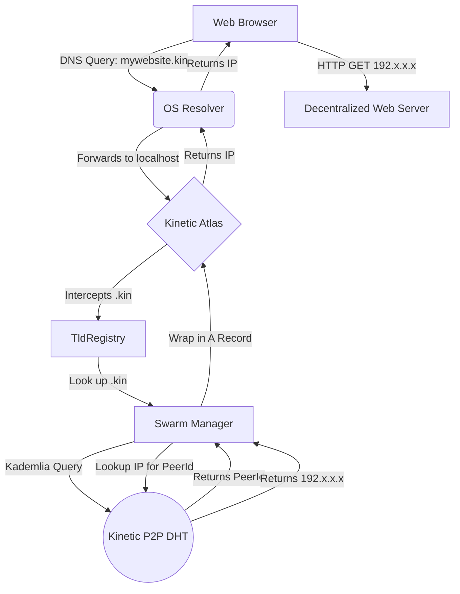

# Kinetic Atlas Architecture

This document outlines the technical architecture, core components, and operational flow of **Kinetic Atlas**, the decentralized DNS bridge for the Kinetic Network ecosystem.

---

## 1. Motivation: Zero-Friction Decentralization

The traditional web relies on the Domain Name System (DNS) controlled by ICANN. Decentralized networks like Kinetic allow users to register domain names (e.g., `mywebsite.kin` or `app.fork`) on an immutable, distributed ledger. 

However, modern browsers (Chrome, Firefox, Safari) and operating systems (Windows, macOS, Linux) do not understand how to query a blockchain for a website IP address. Historically, projects required users to install custom browser extensions or use specialized browsers to bridge this gap.

**Kinetic Atlas** takes a different approach:
It runs locally on the user's machine as a standard, fully compliant **DNS Server**. The user simply points their Operating System's DNS resolver to `localhost`. When a browser requests `mywebsite.kin`, the OS queries Atlas. Atlas routes the request into the Kinetic peer-to-peer network, fetches the decentralized IP, and hands it back to the browser as a standard `A` or `AAAA` record. 

To the browser, it looks like a normal website. No extensions required.

---

## 2. Core Components

The Atlas proxy is comprised of several concurrent sub-systems operating in tandem:

### 2.1 The DNS Interface (`hickory-server`)
Atlas utilizes the robust `hickory-server` crate to bind to local UDP/TCP ports (typically `53` or `5353`). It acts as a DNS forwarder:
- If a query ends in a standard ICANN TLD (like `.com` or `.net`), Atlas ignores it or forwards it to Cloudflare/Google DNS.
- If a query ends in a registered Kinetic TLD (e.g., `.kin`), Atlas intercepts the packet and begins the decentralized resolution process.

### 2.2 The Registry Engine (`TldRegistry`)
Because Kinetic allows anyone to fork the code and start their own parallel networks, Atlas must know *which* network to query for *which* domain.
- Atlas maintains a thread-safe `RwLock<TldRegistry>`.
- On startup, it reads the `/networks` directory containing lightweight `.json` files.
- Each JSON file maps a `TLD Suffix` (e.g., `kin`) to its respective `network_id`, `seed_domain`, `local_bind_ip`, and `bootstrap_nodes`.

### 2.3 The Swarm Manager (Libp2p DHT)
Atlas is essentially a multi-network router. It doesn't just connect to one network; it connects to *all* registered networks simultaneously.
- For every configured network in the `TldRegistry`, the Swarm Manager spins up an isolated **Libp2p Kademlia DHT Swarm**.
- Atlas binds to the `local_bind_ip` designated in the network's JSON config to prevent port collisions on the host machine.
- It dials the hardcoded bootstrap nodes to enter the DHT.

### 2.4 The `PeerId` Resolution Engine
Decentralized domains rarely point to static IP addresses. Instead, they point to a cryptographic Libp2p `PeerId`.
When Atlas intercepts a query for `mywebsite.kin`:
1. It identifies that `.kin` belongs to the `kinetic` network.
2. It asks the `kinetic` Kademlia DHT: *"Who owns the domain mywebsite?"*
3. The DHT returns a `RevealPayload` containing a `PeerId`.
4. Atlas performs a secondary DHT lookup: *"What is the current public IP address of this PeerId?"*
5. The DHT returns the dynamic IP address.
6. Atlas wraps that IP address into a standard DNS `A` record and returns it to the operating system.

### 2.5 Daemon Synchronization (`sync_with_kinetic`)
Atlas runs a background synchronization loop. It communicates with the local `kinetic-daemon` to ensure the local user node is aware of the actively serviced TLDs and seamlessly routes RPC or specialized traffic between the DNS proxy and the node.

---

## 3. The Global Registry Automation (GitHub Actions)

Because Atlas relies on unique TLD mapping to avoid collisions (e.g., two different networks trying to claim the `.kin` TLD), the `kinetic-atlas` GitHub repository acts as the global namespace arbiter.

We utilize a **Zero-Touch Automated Pipeline**:
1. **Application:** A network operator submits a GitHub Issue using the *Register Network* template.
2. **Validation (`validate_registration.py`):** An automated Python script verifies that the requested `TLD`, `network_id`, and `local_bind_ip` are 100% globally unique across the ecosystem.
3. **Liveness Check:** The bot verifies the network is actually functional by checking its Seed Domain URL or pinging its Bootstrap TCP nodes.
4. **Auto-PR:** If validation passes, a Pull Request is automatically generated containing the new JSON configuration and an updated `ATLAS.md` discovery directory.
5. **Daily Monitoring (`monitor_networks.py`):** A cron job runs every night to ping every network's bootstrap nodes. If a network falls offline for 7 consecutive days, its status badge in the directory is automatically downgraded to `🔴 Offline`.

---

## 4. Summary Flow Diagram



## 5. Network Configuration Schema
To provide a concrete example of how the registry maps networks, here is the exact JSON structure that Atlas parses at runtime. The automated pipeline ensures this is kept perfectly minimal for lightning-fast parsing:

```json
{
    "network_id": "kinetic",
    "tld": "kin",
    "local_bind_ip": "127.0.0.1",
    "seed_domain": "seed.kinetic.network",
    "bootstrap_nodes": [
        "/ip4/44.219.188.204/tcp/6070/p2p/12D3KooW..."
    ]
}
```

## 6. Thread Safety and Concurrency
Because Atlas handles highly concurrent DNS UDP requests from the operating system, the internal `TldRegistry` is wrapped in an `Arc<RwLock<TldRegistry>>`. This guarantees that:
- DNS queries can be read in parallel with zero blocking (`RwLock::read`).
- If the background sync loop or a new GitHub PR pull updates a network's JSON configuration, Atlas can acquire a write lock (`RwLock::write`) to hot-reload the registry in milliseconds without dropping any active DNS queries or requiring a server restart.
